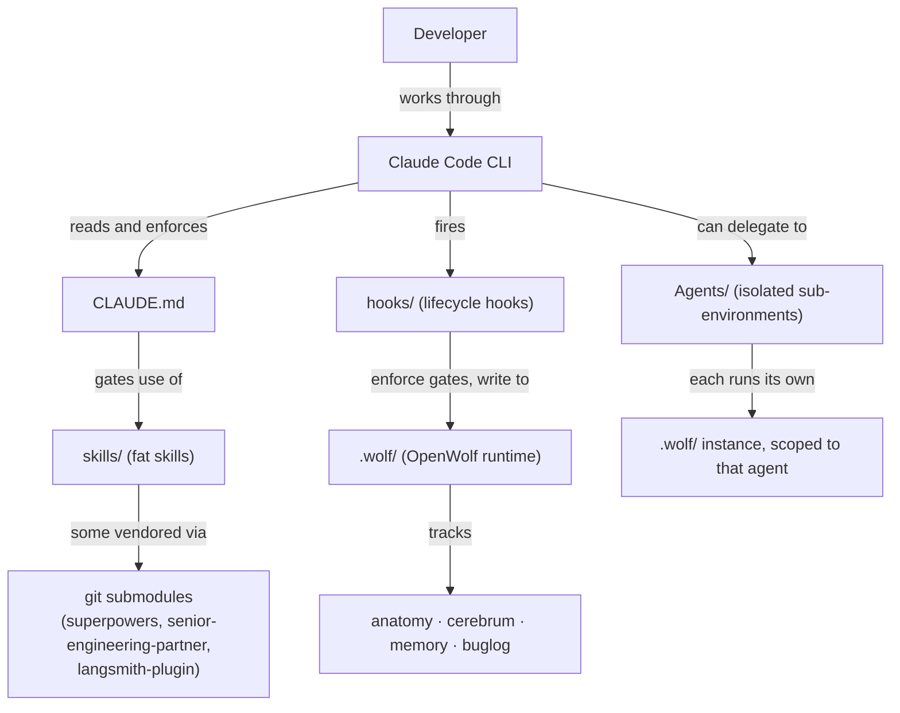

- **`CLAUDE.md`** is the root instruction set — read as structured data, not a loose style guide.
- **`skills/`** are the "fat" behavior modules `CLAUDE.md` gates access to. Some are authored directly in this repo; others are pulled in as git submodules from external projects and used as-is.
- **`hooks/`** turn the process gates described in `CLAUDE.md` from prose into real enforcement — blocking actions, not just suggesting them.
- **`.wolf/`** is OpenWolf's runtime: a per-project memory and tracking layer that hooks write to and skills read from, so decisions and learnings persist across sessions instead of resetting every conversation.
- **`Agents/`** hold fully self-contained sub-environments — a custom agent gets its own `.wolf/` instance, isolated from the parent project's.

See [Core Philosophy](/overview/core-philosophy) for why this split exists, and [Infrastructure Layer](/overview/infrastructure-layer) for how the enforcement mechanics work.
