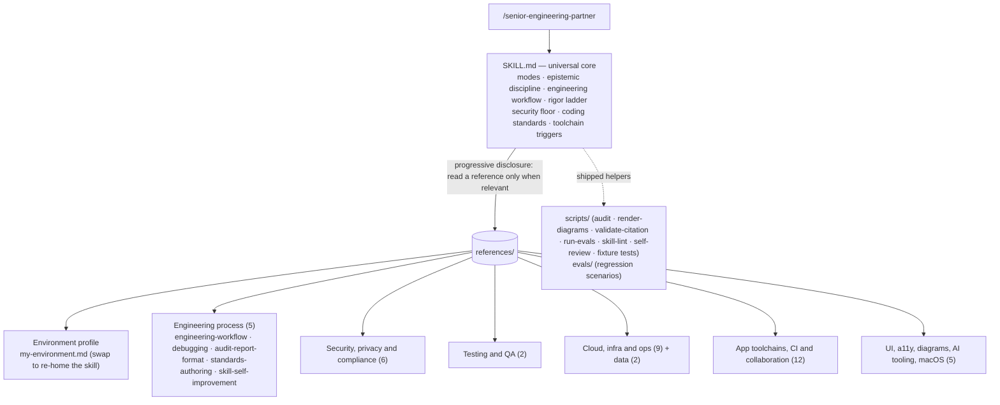
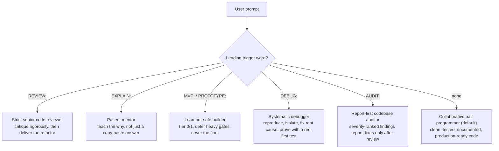
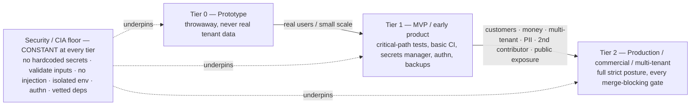

# senior-engineering-partner

Last updated: 2026-07-21 12:32 PM CDT

[](LICENSE)
[](https://github.com/bjgreenberg/senior-engineering-partner/releases)
[](https://github.com/bjgreenberg/senior-engineering-partner/actions/workflows/docs-render.yml)
[](https://github.com/bjgreenberg/senior-engineering-partner/actions/workflows/leakage-guard.yml)
[](https://github.com/bjgreenberg/senior-engineering-partner/actions/workflows/shellcheck.yml)
[](https://scorecard.dev/viewer/?uri=github.com/bjgreenberg/senior-engineering-partner)
[](https://www.bestpractices.dev/projects/13458)
[](https://www.conventionalcommits.org/en/v1.0.0/)

A custom Claude Code skill: a strict **code reviewer, pair programmer, debugger, and mentor** for
Python, Bash, Google Apps Script, and JavaScript. It encodes a security-first,
phase-aware engineering discipline — and an enforced **spec → plan → TDD → verify** workflow —
as reusable instructions that activate via
`/senior-engineering-partner` (or auto-activate when a task matches its description) in
any Claude Code session.

> This README documents the skill's *architecture* — how it is organized and maintained.
> The skill's actual instructions live in [`SKILL.md`](index.md); the deep, per-topic
> standards live in `references/`.

- **Author:** Brian Greenberg · **Web:** https://briangreenberg.net
- **Version:** see the metadata table at the bottom of [`SKILL.md`](index.md), the
  `CHANGELOG.md`, and the
  [Releases](https://github.com/bjgreenberg/senior-engineering-partner/releases) page
- **Invoke:** `/senior-engineering-partner` in Claude Code, optionally prefixed with a
  mode trigger word (see [Modes](#modes--triggers)).

## Contents

- [What it is](#what-it-is)
- [What it governs](#what-it-governs)
- [Architecture](#architecture)
- [Modes & triggers](#modes--triggers)
- [The rigor ladder](#the-rigor-ladder)
- [Reference catalog](#reference-catalog)
- [Shipped helpers & evals](#shipped-helpers--evals)
- [Install](#install)
- [Using it with other AI tools (Codex, Gemini CLI, …)](#using-it-with-other-ai-tools-codex-gemini-cli-)
- [Customize for your environment (my-environment.md)](#customize-for-your-environment-my-environmentmd)
- [Maintaining / contributing](#maintaining--contributing)
- [Citing this repository](#citing-this-repository)
- [License](#license)
- [Disclaimer](#disclaimer)

---

## What it is

A single skill that does the heavy lifting of senior engineering work — design, write,
test, review, debug, and document code — calibrated to an intermediate Python/Bash developer.
Three ideas run through everything:

- **Phase-aware rigor, with a security floor that never moves.** Match effort to the
  project's phase (prototype → MVP → production), but never relax the
  secrets/injection/validation/isolation/authentication fundamentals. *Cheap ≠ insecure.*
- **Deterministic-first, anti-hallucination discipline.** Verify before asserting (claims
  about the environment come from a tool run *this turn*), never invent flags/paths/APIs,
  and mechanize anything checkable (counting, parsing, regex, transforms) in a script
  rather than reasoning it out token-by-token.
- **An enforced workflow, not just standards.** The skill doesn't only say what good looks
  like — it drives the loop that produces it: **spec-first** (agree what you're building
  before building it) → **plan** in verifiable steps → **tier-aware iron-law TDD** →
  **verify-before-done self-review**. Depth scales with the rigor tier; the loop does not.

<sub>[↑ Back to contents](#contents)</sub>

---

## What it governs

The disciplines are stack-agnostic, but they bind to concrete tooling. At a glance, what the skill
carries standards for:

- **Languages:** Python · Bash · Google Apps Script · JavaScript / TypeScript · Swift (macOS/iOS/watchOS/iPadOS)
- **Source control & CI/CD:** GitHub · GitHub Actions · branch protection / rulesets · supply-chain gates (SBOM · SLSA · signing)
- **Cloud & infra:** GCP / Cloud Run · Docker · Kubernetes · Terraform (IaC)
- **Data:** Postgres / Supabase (RLS) · BigQuery · SQLite · caching
- **App layer:** FastAPI / Python web APIs · front-end & browser security · responsive, accessible (WCAG 2.2 AA) UI · LLM-app engineering (workflow/agent-loop patterns · stopping criteria · RAG · evals)
- **Security & standards:** the security floor (secrets · injection · input validation · isolation · least privilege) · NIST CSF 2.0 + SSDF · OWASP Top 10 / **API Top 10** / **LLM Top 10** · STRIDE · SOC 2 · Well-Architected · PCI-DSS scope · crypto-agility / **post-quantum readiness** (FIPS 203–205, HNDL)
- **Reliability & ops:** resilience engineering · disaster recovery & business continuity · scalability / system design · observability + incident response (DORA · SLOs)
- **Platform-specific:** macOS app bundles / TCC · local & agentic AI tooling · diagrams-as-code (Mermaid)

Each binds to a deep, **read-on-demand** reference (see the [catalog](#reference-catalog) below); your
concrete hosts, projects, and stack live only in the private, un-committed `references/my-environment.md`.

<sub>[↑ Back to contents](#contents)</sub>

---

## Architecture

The skill is a **stack-agnostic universal core** (`SKILL.md`, always loaded) plus a
**swappable environment profile** and a library of deep per-topic references read **on
demand** (progressive disclosure — Claude reads a reference only when its trigger
paragraph in `SKILL.md` says the work is relevant). Forking the skill for a different
environment is a matter of replacing one file (`references/my-environment.md`).



`SKILL.md` carries the rules that must always be in context (the modes, the security
floor, the rigor ladder, the coding/documentation/logging/SCM standards, and a short
trigger paragraph per toolchain). Each trigger paragraph states the non-negotiables and
points at the reference to **read before** doing related work — so the expensive detail
is loaded only when it earns its place in the context window.

<sub>[↑ Back to contents](#contents)</sub>

---

## Modes & triggers

Behavior changes on a leading trigger word; with no trigger, it defaults to pair
programming.



| Trigger | Mode | What it does |
|---|---|---|
| *(none)* | **Pair programmer** | Do the work — production-ready code with tests + docs, concise explanation. |
| `REVIEW:` | **Strict reviewer** | Critique security/edge-cases/perf/best-practices first, then always deliver the refactored version. |
| `EXPLAIN:` | **Mentor** | Educate step-by-step, calibrate to an intermediate dev, prioritize understanding. |
| `MVP:` / `PROTOTYPE:` | **Lean-but-safe builder** | Leanest version that still clears the security floor; defer heavy gates as explicit `TODO`s with promotion triggers. |
| `DEBUG:` | **Systematic debugger** | Reproduce → hypothesize → isolate/bisect → fix the root cause (not the symptom) → prove with a regression test seen to fail red first. |
| `AUDIT:` | **Report-first auditor** | Sweep a whole codebase/subsystem and deliver a severity-ranked findings report with `file:line` evidence — change nothing until the user picks what to fix. |

<sub>[↑ Back to contents](#contents)</sub>

---

## The rigor ladder

Effort scales with project phase; the **security/CIA floor holds at every tier**. Only
verification depth, redundancy, and operational maturity scale.



Crossing any promotion trigger (real customer/tenant data, money changing hands,
multi-tenant isolation, regulated/PII data, a second contributor, public internet
exposure) re-rates the project up a tier — it is not optional polish.

<sub>[↑ Back to contents](#contents)</sub>

---

## Reference catalog

Deep standards, read on demand. Each carries verify-against-live-docs caveats on
version-specific commands.

| Group | Reference | Covers |
|---|---|---|
| **Environment profile** | `my-environment.md` | The concrete stack/hosts/repos/house-Git-standards — the one file to swap when forking the skill |
| **Engineering process** | `engineering-workflow.md` | The spec → plan → tier-aware iron-law TDD → verify-before-done self-review loop |
| | `debugging.md` | Systematic root-cause method (the `DEBUG:` mode): reproduce → hypothesize → isolate → fix cause → red-first regression test |
| | `audit-report-format.md` | The `AUDIT:` mode deliverable: a severity-ranked findings report (finding schema, severity taxonomy, mechanize-the-checkable, lead-with-verified-strengths) |
| | `standards-authoring.md` | Distill sprawling project conventions into a checkable standards set (extract → filter → human-approve → classify floor-vs-overridable); prose-first, format-agnostic |
| | `skill-self-improvement.md` | The consent-gated loop's full procedure: classify (pattern / one-off / irreversible-cost), the three-part proposal package (rule + guarding eval + origin story), ship-through-PR, never-relax, the non-maintainer path |
| **Security, privacy & compliance** | `threat-modeling-and-api-design.md` | In-PR STRIDE threat models + attack-surface-shrinking API design |
| | `secure-data-processing.md` | Hostile-file parsing, prompt-injection fencing (two-zone worked example), RAG/vector-store isolation, multi-tenant data handling |
| | `frontend-web-security.md` | Token storage, CSP, output sanitization, security headers |
| | `secrets-and-key-rotation.md` | Rotation lifecycle, zero-downtime overlap, KMS key-version re-wrap |
| | `data-protection.md` | GDPR/UK-GDPR/CCPA as code: DSAR, erasure cascade, retention, DPIA |
| | `compliance.md` | NIST CSF 2.0 + **SSDF (800-218)** / OWASP / SOC 2 / **Well-Architected** as enforceable review checklists, incl. crypto-agility + **post-quantum readiness** (FIPS 203–205, harvest-now-decrypt-later triage) |
| **Testing & QA** | `testing.md` | The enforced merge-gate taxonomy, tenant-isolation tests, coverage/mutation/load tiers, frontend testing (behavior-not-implementation, network-boundary mocks, E2E/a11y gates) |
| | `testing-single-file.md` | The `conftest.py` argv-patch pattern for single-file scripts |
| **Cloud, infra & ops** | `gcp.md` | Cloud Run, GCS, BigQuery, Secret Manager, IAM (no SA keys → Workload Identity) |
| | `iac-terraform.md` | Terraform on GCP, locked remote state, OIDC deployer, plan-as-gate |
| | `containers-and-orchestration.md` | Docker/Kubernetes: digest pins, non-root, scanning, securityContext |
| | `observability-and-incident-response.md` | Structured logs + correlation id, RED/USE metrics, SLO burn-rate alerting + severity-routed channels, client-side/RUM monitoring, incident lifecycle |
| | `disaster-recovery.md` | 3-2-1-1-0 immutable backups (Bucket Lock, not just versioning), out-of-domain copies, verified PITR, scheduled restore drills, local/sync-≠-backup |
| | `business-continuity.md` | BIA → justified RTO/RPO, provider-outage plans, comms/decision plan, the solo-operator/bus-factor path |
| | `resilience-engineering.md` | Degrade-don't-die in code: timeouts, circuit breaker, bulkhead, load-shed, designed degraded modes, kill-switch |
| | `scalability-and-system-design.md` | The "-ilities": statelessness for horizontal scale, queue+worker, DLQ, transactional outbox, the pool/N+1/hot-partition ceilings, capacity & perf targets |
| | `logging-and-monitoring.md` | Structured logging in Python (JSON + `contextvars` correlation id, per-stack loggers), log location/rotation, the launchd open-fd gotcha, unattended-job monitor design |
| **Data** | `databases.md` | Postgres/Supabase RLS (+ pgTAP), BigQuery, SQLite, migrations |
| | `caching.md` | Cache-key-must-encode-the-tenant, invalidation, what-not-to-cache |
| **App toolchains, CI & collaboration** | `python-web-apis.md` | FastAPI/Uvicorn/psycopg: lifespan, Pydantic, auth-as-`Depends`, RLS pipeline |
| | `github-actions.md` | Least-priv `permissions`, SHA-pinned actions, multi-gate pipelines (audit/typecheck/lint), the Swift/Apple job shape (macOS runners, pinned resolution, ASC-API-key signing), SBOM + build-provenance attestation, gated deploy + canary + release automation |
| | `github-teams.md` | Team-grade repo hygiene (required gates, CODEOWNERS, review every agent PR) |
| | `package-managers.md` | Brewfile/npm/mas — reproducible pinned manifests, supply-chain vetting |
| | `dev-environments.md` | VS Code/Xcode/Antigravity hygiene, extension vetting, signing |
| | `dev-environment-isolation.md` | Never dev against prod, per-project venv/container, sandbox untrusted code |
| | `foss-adoption.md` | Vet FOSS before adopting (license/Scorecard/CVEs) + pin/lock/contract-test |
| | `multi-agent-coordination.md` | The concurrency override when >1 writer shares a repo |
| | `python-typing-and-packaging.md` | The TypedDict worked example + the single-file→package target layout |
| | `google-apps-script.md` | `clasp` + git over the editor, minimal `oauthScopes`, `PropertiesService` secrets/limits, `LockService`, trigger quotas + the 6-min wall, Advanced Services vs `UrlFetchApp`, `console`→Cloud Logging, pure-logic isolation for testing |
| | `javascript-and-typescript.md` | TS strict mode (the `mypy --strict` analog) + the flags `strict` misses, runtime-validated typed boundaries (the Pydantic analog), Node `SIGTERM`/no-floating-promises patterns |
| | `bash-scripting.md` | Strict mode's documented gaps (`-e` suspension, masked substitutions), traps/atomic output/locks, `curl -f`, stock-bash-3.2 portability, BATS + command stubs |
| | `swift-apple-development.md` | XcodeGen `project.yml` as source of truth, SwiftPM pure-logic packages, headless provisioning, never-store-ticks state design, the `CKSyncEngine` hard rules, Swift 6 concurrency field notes, `log stream`/`.ips` diagnosis — plus the enforcement lane: SwiftLint/`swift format`/compiler gates, committed `Package.resolved` + `osv-scanner` audit, the Apple security-floor bindings (Keychain, sandbox/entitlements, ATS, privacy manifests, entry-surface validation), Swift Testing/XCTest + `xccov` coverage gate, CI wiring |
| **UI, docs & AI tooling** | `ui-design-and-accessibility.md` | Responsive + light/dark + WCAG 2.2 AA + Claude Design handoff |
| | `diagrams-and-visual-docs.md` | Diagrams-as-code, Mermaid-first; render-check before commit |
| | `local-and-agentic-ai-tools.md` | Agentic assistants + self-hosted LLMs (Ollama/Open WebUI) |
| | `llm-apps.md` | Building software that contains model calls: the five workflow patterns, evaluator-optimizer preconditions, the agent loop (verify every iteration), stopping criteria + cost budgets, RAG as architecture (retriever evals, index as derived cache), evals as the outer loop |
| | `macos-app-bundles.md` | LaunchAgent `.app` bundles, TCC/FDA, the compiled-launcher requirement |

<sub>[↑ Back to contents](#contents)</sub>

---

## Shipped helpers & evals

Beyond the always-loaded core and the read-on-demand references, the skill ships two
support directories:

- **`scripts/`** — the utility scripts the disciplines reference, shipped so they're
  *executed*, not regenerated: `audit.sh` (manifest-level dependency-audit gate),
  `render-diagrams.sh` (the `docs-render` Mermaid render-check), `validate-citation.sh`
  (the `citation-validate` CFF schema check), `run-evals.py` (the
  eval-suite runner — below), and `self-review.md` (the verify-before-done checklist).
  Pin `render-diagrams.sh`'s `MMDC_IMAGE` to a digest before relying on it.
- **`evals/`** — a regression suite. Each `scenarios/*.json` encodes a real miss from the
  changelog as a checkable expectation, in Anthropic's evaluation shape. `evals/README.md`
  documents the baseline-then-iterate (Claude-A authors / Claude-B tests) loop, and
  **`scripts/run-evals.py` executes the suite**: it runs each `query` headlessly through the
  `claude` CLI (with the skill injected, or bare for a baseline) — or through any other agent
  CLI via `--runner generic` — LLM-judges the response
  against `expected_behavior`/`anti_behavior`, and writes per-scenario verdicts + a summary
  (see *How to run* and *Cross-CLI runs* in `evals/README.md`). **Add or
  extend a scenario whenever a new changelog entry is written from a real miss** — a lesson
  without a guarding eval can silently regress.

<sub>[↑ Back to contents](#contents)</sub>

---

## Install

Two ways into Claude Code — pick **one** (a side-by-side plugin install and skill clone
would load the skill twice):

### As a plugin (quickest)

The repo doubles as its own single-plugin marketplace
([`.claude-plugin/marketplace.json`](.claude-plugin/marketplace.json)), so two commands
inside Claude Code install it:

```
/plugin marketplace add bjgreenberg/senior-engineering-partner
/plugin install senior-engineering-partner@bjgreenberg
```

Updates track the versioned
[Releases](https://github.com/bjgreenberg/senior-engineering-partner/releases): refresh
with `/plugin marketplace update bjgreenberg` and Claude Code offers the new version.
**Trade-off:** plugin installs are copied into Claude Code's plugin cache and replaced
wholesale on every update, so the per-user environment profile
(`references/my-environment.md`, [next section](#customize-for-your-environment-my-environmentmd))
cannot persist there — a plugin install always runs the universal core against the assumed
baseline (macOS, Bash, GitHub, a secret manager, a scale-to-zero cloud target). That is the
right default for most users; to customize the profile, use the clone install instead.

### As a skill clone (customizable)

Claude Code also loads skills from `~/.claude/skills/`. Clone this repo into that
directory under the skill's own name:

```bash
git clone https://github.com/bjgreenberg/senior-engineering-partner \
  ~/.claude/skills/senior-engineering-partner
```

Then **customize it for your environment** (next section); update with a plain `git pull`
in the clone.

Either way, invoke it with `/senior-engineering-partner` (optionally prefixed with a mode
trigger word). The universal core works out of the box against the assumed baseline; the
profile is what makes its guidance specific to *you*.

<sub>[↑ Back to contents](#contents)</sub>

## Using it with other AI tools (Codex, Gemini CLI, …)

None of this skill's *content* is Claude-specific (the few Claude-bound helpers are
disclosed at the end of this section): the always-loaded core and every reference are
plain Markdown, the mode triggers (`REVIEW:`, `DEBUG:`, …) are plain prompt conventions, and
the packaging — a directory whose `SKILL.md` carries `name` + `description` frontmatter
beside `references/` and `scripts/` — is the same **Agent Skills format** that OpenAI Codex
and Google Gemini CLI (among a growing list of tools) now load natively. Portability tiers,
most to least faithful:

- **Agentic CLIs with native Agent Skills — drop-in.** Codex CLI and Gemini CLI both read
  user-level skills from `~/.agents/skills/`, so one clone serves both:

  ```bash
  git clone https://github.com/bjgreenberg/senior-engineering-partner \
    ~/.agents/skills/senior-engineering-partner
  ```

  Gemini CLI can also install straight from the repo URL (`gemini skills install …`), and
  both tools offer explicit invocation (`/skills`; `$`-mention in Codex) or implicit
  selection by the skill's `description`. Create `references/my-environment.md` from the
  template exactly as in the next section — that step is tool-agnostic.

- **Agentic tools without skills support — via the context file.** Any agent that reads
  the [`AGENTS.md` standard](https://agents.md/) (Cursor, Zed, Aider, GitHub Copilot's coding agent, and
  many others) or an equivalent (Gemini CLI's `GEMINI.md`) can carry the skill as standing
  instructions: point the context file at `SKILL.md`'s body — copy it in, or a one-line
  "read `SKILL.md` in this directory and follow it" — keeping `references/` adjacent so the
  "Read `references/<topic>.md`" directives resolve against the working tree.

- **Chat products (Custom GPTs, Gemini Gems) — partial fidelity; know the trade.**
  Instruction fields cap far below the core's size (a Custom GPT allows 8,000 characters of
  instructions plus 20 knowledge files), so the core can only ride along as uploaded
  knowledge — *retrieved*, not always-loaded, which weakens the skill's central design
  (non-negotiables guaranteed in context, detail read on demand). With no shell, the
  enforced half (run the gates, TDD red-first, verify-before-asserting with real commands)
  degrades to advice. Usable for `EXPLAIN:`-style consultation; not equivalent. A research
  product without file or shell access (e.g. Perplexity) isn't a meaningful target.

What stays Claude-specific, disclosed: the eval runner's **judge** drives the `claude` CLI
(scenario responses are pluggable — `scripts/run-evals.py --runner generic` runs the same
suite through any agent CLI via a command template + its instruction file; see *Cross-CLI
runs* in `evals/README.md`); the repo's CI gates are GitHub Actions; and how reliably a
given model *follows* ~80 KB of discipline varies **by model** — the recorded baselines in
`evals/baselines/` measure it per swept Claude model (each records its
own baseline-vs-with-skill gap), and this README makes no equivalent claim for any model
the suite hasn't swept.

<sub>[↑ Back to contents](#contents)</sub>

## Customize for your environment (`my-environment.md`)

The core is deliberately **stack-agnostic** — it carries no hosts, repos, employer, or
machine specifics. Those live in one file you create from the shipped template:

```bash
cd ~/.claude/skills/senior-engineering-partner
cp references/my-environment.template.md references/my-environment.md
$EDITOR references/my-environment.md   # fill in your stack/hosts/Git standards/reference app
```

`references/my-environment.md` is `.gitignore`d, so your real details are never committed —
you can keep your fork's core in sync with this repo (`git pull`) without ever exposing your
profile. The core instructs the assistant to **read `my-environment.md` early and for any
environment-specific claim**, so the more complete it is, the more grounded the guidance.

<sub>[↑ Back to contents](#contents)</sub>

## Maintaining / contributing

- **Versioning + releases are automated** with
  [release-please](https://github.com/googleapis/release-please): it reads the Conventional
  Commits on `main`, opens a release PR that bumps the `Version` in `SKILL.md`'s metadata table
  (and `version`/`date-released` in [`CITATION.cff`](CITATION.cff))
  and prepends the entry to `CHANGELOG.md`. A maintainer enriches that entry's
  narrative, then cuts the **signed** tag + GitHub Release — the repo's `tag-protection` ruleset
  requires signed tags, so that final step is a deliberate manual one (see
  `MAINTAINERS.md` → *Cutting a release*). The skill's own documentation
  discipline, applied to itself.
- **Diagrams are render-checked before commit:** a Mermaid block that fails to render is a
  broken deliverable. Validate with GitHub/VS Code preview, mermaid.live, or
  `@mermaid-js/mermaid-cli` (`mmdc`) — see
  [`references/diagrams-and-visual-docs.md`](references/diagrams-and-visual-docs.md). CI
  runs `scripts/render-diagrams.sh` (the `docs-render` gate) on every PR.
- **Helper scripts are ShellCheck-clean:** a `shellcheck` gate lints `scripts/*.sh` on every PR
  (the skill's own "zero warnings is the standard" applied to itself). A script that trips
  ShellCheck is a broken deliverable and can't merge.
- **No environment-specific leakage in the core:** a `leakage-guard` check greps the tree against
  a denylist of personal/host/repo identifiers. It's **two-tier**: generic class-patterns (a
  CGNAT/Tailscale IP range, Obsidian-style wiki-links) ship in `scripts/leakage-guard.sh` and run in CI,
  while your *literal* identifiers live in an un-committed `references/leakage-denylist.local`
  (created from its `.template`) so the public repo never has to publish them to block them. Keep
  the universal core universal; anything specific belongs in your (un-committed) `my-environment.md`.
- **Add or extend an `evals/` scenario** whenever you add a load-bearing rule — a lesson
  without a guarding eval can silently regress.
- **The skill improves itself — with consent.** `SKILL.md` carries the always-loaded trigger
  of an active, consent-gated self-improvement loop (full procedure:
  [`references/skill-self-improvement.md`](references/skill-self-improvement.md)): when a
  session surfaces a rule-miss with real cost or a correction from the human, the model
  running the skill *proposes* the codified rule (worded to the authoring tests, with its
  guarding eval and origin story) and ships it only through this repo's normal PR +
  human-approval flow. It may add or sharpen rules, never relax them — loosening a
  discipline is human-initiated by definition.

<sub>[↑ Back to contents](#contents)</sub>

## Citing this repository

The repo ships a [`CITATION.cff`](CITATION.cff)
([Citation File Format](https://citation-file-format.github.io/) 1.2.0), so GitHub shows a
**Cite this repository** button (APA/BibTeX) and the
[Zenodo–GitHub integration](https://help.zenodo.org/docs/github/describe-software/citation-file/)
can populate a DOI record from it on release. Two rules keep it honest — the same
stale-claim discipline as the badge row:

- **`version` and `date-released` are bumped by release-please, never by hand** — the
  `x-release-please-version` / `x-release-please-date` annotations in the file mark the
  lines it rewrites in each release PR (the same mechanism as `SKILL.md`'s version stamp).
- **The file is schema-validated as a gate**: `scripts/validate-citation.sh` (digest-pinned
  `cffconvert` container) runs verbatim locally and as the **required** `citation-validate`
  CI check — an invalid citation file cannot merge.

<sub>[↑ Back to contents](#contents)</sub>

## License

Apache-2.0 © Brian Greenberg. See `LICENSE` and `NOTICE`.

Privacy: the plugin collects no data — no telemetry, no network calls, no tracking. The
full statement lives in [`PRIVACY.md`](PRIVACY.md).

<sub>[↑ Back to contents](#contents)</sub>

## Disclaimer

This skill is provided **as is**, without warranty of any kind, under the Apache-2.0 license —
see the *Disclaimer of Warranty* (§7) and *Limitation of Liability* (§8) sections of
`LICENSE`. It offers **engineering guidance, not professional security, legal, or
compliance advice**. Review and validate any code, configuration, or security decision it
influences before relying on it — you are responsible for what you ship.

<sub>[↑ Back to contents](#contents)</sub>
